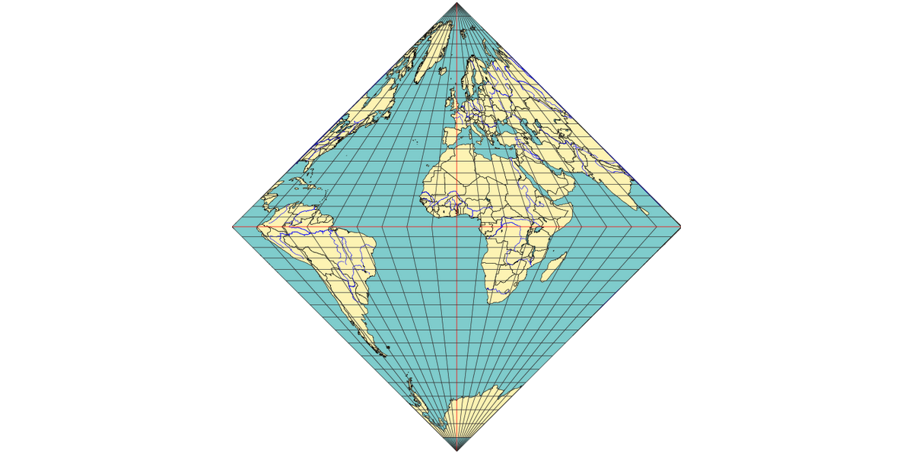

# What is it?

**`collignon::Mesh` is a spheroid mesh that offers all the same guarantees as the HEALpix grid system, in addition to offering O(1) lookups for nearest neighbors, faces, and edges, allowing for dramatic performance improvement. This implementation the `glm` vector math library as its only dependency.**

# How does it work?

## Projection

A `collignon::Projection` is a equal area projection that projects a sphere onto a rhombus shape. It can also be modified to project only part of the sphere. In this library, it projects a single hemisphere onto a square diamond. For performance reasons, it imposes standards on which axes in 3d space map to axes in 2d space (+x points right, +y points up, +z points towards the viewer), however these standards do not propagate to any of the higher levels of abstraction.

To understand how the projection works, we draw a diagram, NESW:

NESW is a square whose area is equal to the area of a unit sphere, $4\pi$. A triangle like NEW has the area of a unit hemisphere, $a=2\pi$. By the Pythagorean theorem, the triangle legs (like NO) have a length of $b=\sqrt{2\pi}$. Since the projection is area preserving, if we draw a horizontal line like AC, we decide the triangle NAC should have the same area as a [spherical cap](https://en.wikipedia.org/wiki/Spherical_cap), which is $2\pi(1-sin\theta)$ for some latitude $\theta$. We notice that NAC is just a scaled down version of NEW: it's area is scaled down by $\frac{2\pi(1-sin\theta)}{2\pi} = 1-\sin\theta$, and its legs are scaled down by the square root of that, $s = \sqrt{1-\sin\theta}$. So the length of NB is $sb$, and the cartesian coordinate $y = b-sb = (1-s)b$. 

That just leaves us with finding $x$. To find $x$, we do a similar thing to another triangle, NOD. We decide that triangle NOD has the same area as a unit hemispherical [wedge](https://en.wikipedia.org/wiki/Spherical_wedge), or $c=2\pi \frac{\phi-\phi_0}{2\pi} = \phi-\phi_0$ for some longitude $\phi$, where $\phi_0$ is the reference longitude that's represented by NO. The length along OD must be $d=\frac{2c}{b}$, and if we scale $d$ by $s$ we find the length along FB. That leaves us with $x = sd$.

The `Projection` class exclusively represents data structures and functions 
that define an isomorphism between points on a sphere and points on this projection.

## Tesselation

An `collignon::Tesselation` is a tesselation of tiles that are made out of rotated and translated projections.

This tesselation has the interesting property that it preserves the topological concept of "closeness":
points that are close together on the tesselation correspond to points that are also close together on a sphere.
You can observe this in the image above: the image may reflect and repeat, 
but each pair of neighboring points on this projection correspond to neighboring points on a globe of the Earth.

The `Tesselation` class exclusively represents data structures and functions 
that define an isomorphism between points on a sphere and points on this tesselation.

## Mesh

The properties of `collignon::Tesselation` allow the construction of a mesh that provides a superset of the guarantees offered by HEALPix:

* arbitrary subdivision of vertices
* closeness preservation (see above)
* hierarchical (trivial, since it allows arbitrary subdivision)
* equal area
* isolatitude

We arrive at this construction by coupling a `collignon::Tesselation` with a bounded 2d Cartesian grid, 
represented by `collignon::Indexing`. We call this construction `collignon::Mesh`.

In addition to mapping memory ids to points on the surface of the sphere,
the `collignon::Mesh` class also derives properties for a given memory id or set of points.
It tracks properties for:
* vertices
* edges
* faces
* arrows
* vertex duals
* arrow duals

Most of these are self explanatory, but "arrows" and "duals" require some explanation.
An "arrow" is a unidirectional edge. There are two arrows for each edge in a mesh. 
Storing arrows separately tends to simplify logic for some operations where direction matters, such as in vector calculus.
A "dual" refers to the dual of a graph, where the "graph" here is the `Mesh`. 
Vertices become faces, and "arrow duals" mark the boundaries of these new faces.

Where applicable, `collignon::Mesh` provides functions to calculate the following properties when given points on the sphere:

* normals
* areas
* lengths
* midpoints
* dual areas
* dual lengths
